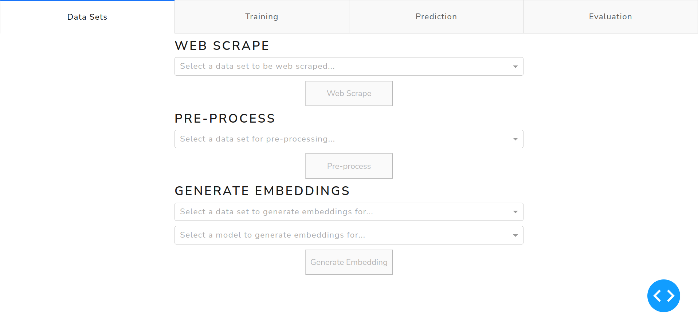

# Movie Genre Classification
This repository contains an implementation of a movie genre classification web application. The application apart from genre prediction also provides a GUI to:
* web-scrape necessary training data sets, 
* pre-process the data sets, 
* train selected model on a selected data set with selected movie genres,
* evaluate trained models on a test data set.

There are currently two available models, which perform the prediction, a statistical model and a machine learning model.

## Repository Structure
```
├── screenshots                               // screenshots of the application
│   ├── evaluation.png
│   ├── datasets.png
│   ├── demo.mp4
│   ├── prediction.png
│   └── training.png
├── scripts                                   // test scripts to try out prediction
│   ├── alien.txt
│   ├── batman.txt
│   └── toy_story.txt
├── src                                       // source files of the project
│   ├── dataset_preparation                   // source file for pre-processing the scraped data sets  
│   │   ├── characters_cleaning.py
│   │   ├── data_prep_pipeline.sh
│   │   ├── description_cleaning.py
│   │   ├── html_tags_cleaning.py
│   │   ├── labels_cleaning.py
│   │   ├── merge.py
│   │   ├── names_cleaning.py
│   │   ├── pipeline.py
│   │   ├── punctuation_cleaning.py
│   │   ├── pure_text_separation.py
│   │   ├── single_character_cleaning.py
│   │   ├── special_cases_cleaning.py
│   │   ├── stemming.py
│   │   └── stopwords_removal.py
│   ├── scraping                              // source files for web-scraping of the data sets
│   │   ├── dailyscript.py
│   │   └── imsdb.py
│   ├── sentence_transformer_model            // source files of the machine learning model
│   │   ├── convert_all_embeddings.sh
│   │   ├── dataset_split.py
│   │   ├── embeddings.py
│   │   ├── evaluation.py
│   │   ├── genres.py
│   │   ├── labels.py
│   │   ├── prediction.py
│   │   └── training.py
│   ├── statistical_model                     // source files of the statistical model  
│   │   ├── dataset_split.py
│   │   ├── evaluation.py
│   │   ├── genres.py
│   │   ├── prediction.py
│   │   └── training.py
│   ├── visualization                         // source files of the web application
│   │   └── app.py
│   ├── seed.py
│   └── utils.py
├── batman_script.txt                         // test script for prediction
├── poetry.lock
├── pyproject.toml
└── README.md
```

## Usage
First, install all necessary Python dependencies with:
```
pip install -r requirements.txt
```

Second, run the web application with:
```
python3 src/visualization/app.py
```
and open up the app at [http://127.0.0.1:8050](http://127.0.0.1:8050).

Third, the advised and fastest flow in the app is to scrape the `imsdb` data set, pre-process it, generate embeddings for the `average_word_embeddings_glove.6B.300d`, train, evaluate and predict using this model.

Last, since the web scraping and mainly generation of the embeddings can run even for several hours on HW without GPU support, we also provide all the data sets scraped and with generated embeddings for all the available models via this link [https://cloud.tugraz.at/index.php/s/ocgNRz5EwSt9A4k](https://cloud.tugraz.at/index.php/s/ocgNRz5EwSt9A4k). Extract the file into the root of the project.

## Web Scraping
We are using 3 data sets to train our models. First two data sets are obtained through web scraping, the third data set is created by merging and deduplicating the two scraped data sets.

### Imsdb Scraper
The Imsdb scraper extracts movie scripts and their respective genres from the [IMSDb](https://imsdb.com) website. It utilizes the `Scrapy` library to crawl and scrape the website. Furthermore, we are extending the functionality of the `Scrapy` library by specifying the target website, the starting URL, and the rules on how to follow links. Then, we are using the `bs4` library for extracting genres, the script title and the script itself from the scraped data. The extracted relevant information is later saved into a JSON file.

### Dailyscript Scraper
The Dailyscript scraper is designed to scrape movie scripts from [The Daily Script](https://www.dailyscript.com/) website and genres from the [Imdb](https://www.imdb.com) website. It again utilizes the `bs4` library for HTML parsing. However, this time we are using a different library, the `urllib` library, for crawling both of the websites. 

## Cleaning and Pre-processing
The web-scraped data are partial HTML pages still with HTML tags left. Furthermore, the scripts itself needs cleaning and pre-processing, as there are many special characters unnecessary spaces etc., which is accomplished by the following pipeline:
1. cleaning of special characters,
2. removal of HTML tags,
3. removal of punctuation characters,
4. removal of some special words like *CLOSE ON*, *CUT* etc.,
5. removal of names,
6. removal of descriptions of the scripts,
7. removal of stopwords (applied only for the statistical model),
8. stemming (applied only for the statistical model),
9. cleaning of the genre labels.

## Statistical Model
The statistical model is based on word counting and its primary role is to asses the performance of the machine learning model. Occurences of words are counted for each genre during training of the model. The prediction is then simply performed by looking up and summing the learned numbers of occurences of words in the predicted sample for all genres. The most probable genre or multiple genres is selected as the one with the largest sum(s). 

The performance of the statistical model trained on the `merged` data set and evaluated on 121 test samples is summarized below:
* Average IoU: 0.289
* Average recall: 0.394
* Average precision: 0.394
* Average F1 score: 0.394

## Machine Learning Model
The machine learning model is more complicated consisting of two sub-models. 

First, a pre-trained sentence transformer model available at [SBERT](https://www.sbert.net/docs/pretrained_models.html#sentence-embedding-models/). We currently support these models:
* `all-mpnet-base-v2`,
* `all-MiniLM-L12-v2`,
* `all-distilroberta-v1`,
* `multi-qa-mpnet-base-dot-v1`,
* `average_word_embeddings_glove.6B.300d`.
Unfortunately, we did not have the necessary compute resources to fine-tune any of these models to our data sets. The sentence transformer models are used to generate embeddings of the movie scripts splitted into samples with 256 words each, as this is the upper limit of a sentence length for some of the models. 

Second, a fully connected neural network with 3 hidden layers with ReLU activation function. The first and second hidden layers are also followed by a dropout layer with 0.25 dropout probability. The sigmoid activation function is used as the activation function of the output layer, since the model is trained to perform multi-class classification. The inputs of this model are the aforementioned embeddings generated by one of the sentence transformer models. The model is trained separately on each set of the generated embeddings with Adam optimizer with default parameters selected by the `TenserFlow` library. More precisely, we perform a 2 stage training. The model is first trained with an validation data set with an early stopping maximizing the validation accuracy with patience for 5 epochs as the stopping criterion. Then, the weights and biases are restored and the model is trained again on a training set including the validation set. The stopping criterion is selected as the epoch, where the validation training run reached the best accuracy.

The prediction is performed by spilling the movies script into samples with 256 words each, generating embeddings for each of the samples, predicting each sample. Finally, the predicted probabilities are averaged and the most probable genre or multiple genres are selected.

The performance of the machine learning models trained on the `merged` data set and evaluated on 121 test samples is summarized below (performance will vary depending on the weigh initialization as we are not using a fixed seed for better interactivity):
* `all-mpnet-base-v2`:
    * Average IoU: 0.484
    * Average recall: 0.566
    * Average precision: 0.680
    * Average F1: 0.585

* `all-MiniLM-L12-v2`:
    * Average IoU: 0.362
    * Average recall: 0.406
    * Average precision: 0.639
    * Average F1: 0.465

* `all-distilroberta-v1`:
    * Average IoU: 0.452
    * Average recall: 0.525
    * Average precision: 0.670
    * Average F1: 0.553

* `multi-qa-mpnet-base-dot-v1`:
    * Average IoU: 0.410
    * Average recall: 0.486
    * Average precision: 0.633
    * Average F1: 0.515

* `average_word_embeddings_glove.6B.300d`:
    * Average IoU: 0.405
    * Average recall: 0.456
    * Average precision: 0.663
    * Average F1: 0.511

## Web Application
The web application is implemented the `dash` library. The web application consists of several tabs that provide different functionalities for data processing, model training, genre prediction and model evaluation. Each tab serves a specific purpose and offers intuitive user interface for easy interactions.

### Data Sets Tab

In this tab, you can perform web scraping and data pre-processing tasks. For each step the previous step has to be executed at least once to work.

* **Web Scraping**: Select a data set from the dropdown menu and click the `Web Scrape` button to initiate the web scraping process. It will take several minutes. A message will be displayed after the web scraping was successfully completed.

* **Pre-process**: Choose a data set for pre-processing using the dropdown menu. Click the `Pre-process` button to start the pre-processing. A message will be displayed after the pre-processed was successfully completed.

* **Generate Embedding**: Select a data set and a model from the respective dropdown menus. Click the `Generate Embeddings` button to generate embeddings for the chosen model and data set. It will again take several minutes or hours depending on the chosen model and your HW capabilities. A message will be displayed after the embeddings were successfully generated.

### Train Tab

In this tab, you can train and re-train models.

* **Training**: Choose a model and a data set from the respective dropdown menus. Additionally, select the desired genres, on which the model should be trained using the available multi-select. Click the `Train` button to begin the training process. It will take several minutes depending on the chosen model and your HW capabilities. A message will be displayed after the model was successfully trained.

* **Retrain**: Select already trained model from the dropdown menu and click the `Retrain` button to initiate the re-training process of the selected model with a different weight initialization. It will take several minutes depending on the chosen model and your HW capabilities. A message will be displayed after the model was successfully re-trained.

### Prediction Tab

In this tab, you can predict genres based using the trained models.

* **Predict Genre**: Select a trained model from the dropdown menu. Enter the number of genres to predict and provide a script in the textarea. We also provide some test scripts in the `scripts/` directory for your convenience. Click the `Predict` button to perform the prediction. The predictions will be displayed once successfully completed.

### Evaluation Tab

In this tab, you can evaluate trained models and compare their performance.

* **Model Evaluation**: Choose a trained model and a data set from the respective dropdown menus. Click the `Evaluate` button to evaluate the selected model's performance. The evaluation results will be shown once successfully completed.

* **Model Comparison**: This section provides a visual comparison of the already evaluated models. We allow to train a model on one of the 3 training data sets (*imsdb*, *dailyscript* and *merged*) and we also allow to test any model, regardless on which training data set it was trained, on the respective 3 test data sets. We display the evaluation as 4 bar plots, each for one of the following evaluation metrics:
    * intersection over union, 
    * precision, 
    * recall and
    * F1 score. 

## Demo
The following video captures the functionality of the whole web application:  
<video src="./screenshots/demo.mp4" controls="controls">
</video>
